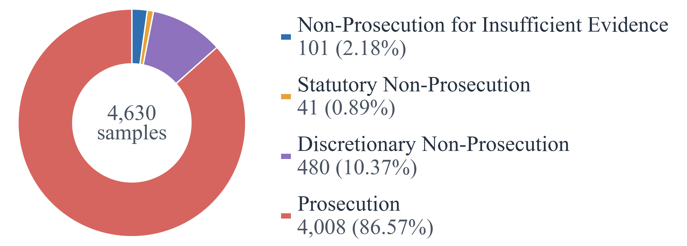
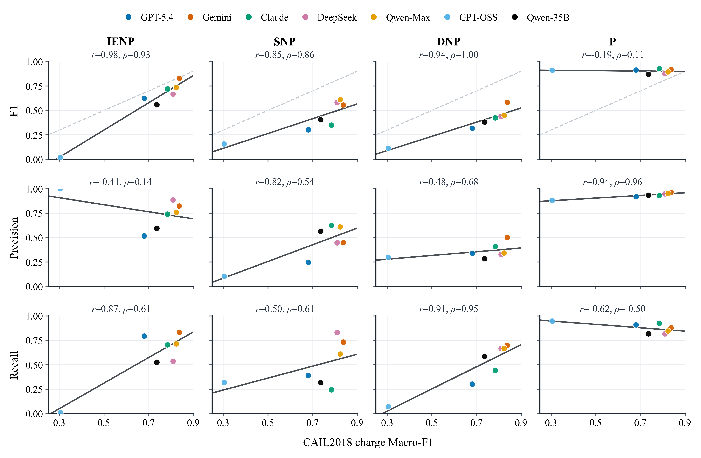
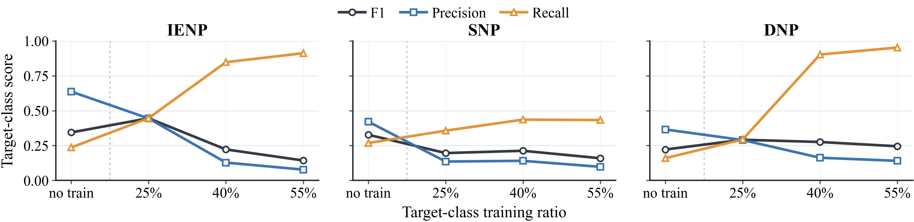
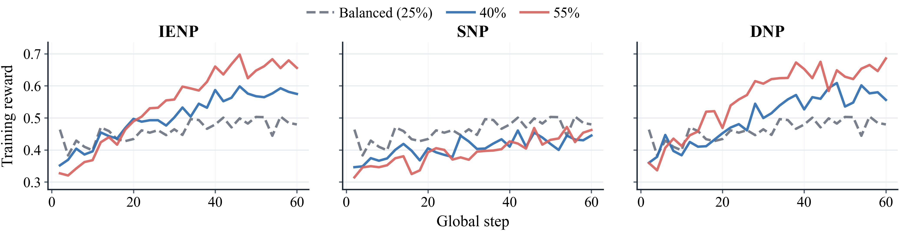

# PDP-Bench

[English](README.md) | 中文

**论文：** 预印本即将发布


## 简介

刑事法律判决预测（Legal Judgment Prediction, LJP）通常只处理已经进入审判程序的案件，预测罪名、法条和刑期。但在审判之前，检察机关已经通过审查起诉决定哪些案件进入审判，哪些案件因证据不足、依法不负刑事责任或有罪但可免予处罚而被不起诉分流。因此，审判阶段 LJP 天然看不到三类关键刑事责任状态。

为补上这一空白，本项目提出 **Prosecution Decision Prediction (PDP, 公诉决定预测)**：将评测锚点前移到审查起诉阶段，要求模型根据犯罪嫌疑人信息、案件程序信息和案件事实，在四类公诉决定之间作出预测。PDP 不只是更早阶段的分类任务，它同时考察模型的证据评价、法律涵摄和价值裁量能力。

四类标签：

- `P`：起诉
- `DNP`：相对不起诉
- `SNP`：法定不起诉
- `IENP`：存疑不起诉

PDP-Bench 当前包含 **4,630** 条公开中文检察文书样本，时间跨度为 **2014 年 1 月至 2026 年 3 月**，覆盖中国大陆 **31 个省级行政区**。每条样本保留公开来源链接，并包含结构化字段、适用法条、公诉决定和原始审查意见等信息。



## 研究问题

本项目围绕三个问题展开实验：

1. PDP 是否对当前 SOTA LLM 构成系统性挑战？
2. test-time scaling、法律领域专门化和提示增强能否解决 PDP？
3. 类别增强的 RLVR / DAPO 训练能否提升模型在少数类责任边界上的判别能力？

实验报告 `Macro-F1`、`Micro-F1` 和类别级 F1，并同时评估两种粒度：`PDP L1` 为起诉 / 不起诉二分类，`PDP L2` 为四分类。

## 实验结果

### LJP-PDP 能力差距



PDP-Bench 暴露出传统审判阶段 LJP 难以覆盖的责任边界，尤其体现在 `SNP` 与 `DNP` 等类别上。

### RQ3 类别占比干预



提高目标类别训练占比主要改变预测偏好，并不稳定转化为可泛化的类别级 F1 提升。

### DAPO 训练奖励曲线



训练奖励曲线用于观察不同类别干预组在 DAPO 训练过程中的优化动态。

## 仓库结构

```text
.
|-- assets/           # README 图片
|-- configs/          # DeepSpeed 配置
|-- eval/             # vLLM / OpenRouter 评测与指标计算
|-- scripts/          # RQ1/RQ2/RQ3 批量脚本
|-- train/            # DAPO 训练与奖励函数
|-- visual/           # 图表生成脚本
|-- prompt_template.py
|-- requirements.txt
|-- README.md
`-- README.zh-CN.md
```

本地数据、模型权重、实验输出和论文中间产物请放在本机约定目录中，不要提交到仓库。

## 环境准备

建议使用 Linux / WSL / CUDA 环境运行训练和 vLLM 评测。OpenRouter API 评测可在普通 Python 环境中运行。

```bash
conda create -n pdp python=3.11 -y
conda activate pdp
pip install -r requirements.txt
```

OpenRouter API key：

```bash
export OPENROUTER_API_KEY="sk-or-v1-..."
```

PowerShell：

```powershell
$env:OPENROUTER_API_KEY = "sk-or-v1-..."
```

## 数据约定

评测脚本默认读取本地 HuggingFace `DatasetDict` 目录：

- `data/pdp4k`：PDP-Bench 测试数据，通常包含 `test` 与 `test_rq2` split
- `data/pdp2k_rq3`：RQ3 训练数据，包含不同类别占比干预 split

常见 RQ3 split：

- `natural`
- `balanced`
- `P-40`, `P-55`
- `DNP-40`, `DNP-55`
- `SNP-40`, `SNP-55`
- `IENP-40`, `IENP-55`

## 评测

### vLLM

```bash
python eval/evaluate_vllm.py \
  --model-path models/Qwen3-8B \
  --data-path data/pdp4k \
  --split test \
  --output-dir results/vllm/Qwen3-8B
```

常用参数：

- `--prompt-variant original|definitions|one_shot`
- `--num-repeats 8`
- `--max-model-len 16384`
- `--max-tokens 8192`
- `--tensor-parallel-size 1`
- `--batch-size 200`

### OpenRouter

```bash
python eval/evaluate_openrouter.py \
  --model qwen/qwen3.6-max-preview \
  --data-path data/pdp4k \
  --split test \
  --output-dir results/RQ1 \
  --prompt-variant original \
  --reasoning-effort auto
```

批量脚本：

```powershell
.\scripts\eval_RQ1.ps1
.\scripts\eval_RQ2_1.ps1
```

```bash
bash scripts/eval_openrouter.sh
bash scripts/eval_vllm.sh
```

### 重新计算指标

```bash
python eval/metrics.py results/RQ1
```

评测输出通常包含 `details_*.json` 与 `metrics.md`。

## DAPO 训练

快速调试：

```bash
python train/dapo.py \
  --model-path models/Qwen3-8B \
  --data-path data/pdp2k_rq3 \
  --split balanced \
  --output-dir results/dapo_smoke \
  --max-samples 32
```

多 GPU / DeepSpeed：

```bash
bash scripts/train_RQ3_dapo.sh
```

指定训练组：

```bash
bash scripts/train_RQ3_dapo.sh DNP-40 DNP-55
```

常用环境变量：

```bash
MODEL_PATH=models/Qwen3-8B \
DATA_PATH=data/pdp2k_rq3 \
OUTPUT_ROOT=results/RQ3_DAPO \
NUM_GPUS=2 \
VLLM_TP=2 \
BATCH_SIZE=8 \
GRAD_ACCUM=64 \
bash scripts/train_RQ3_dapo.sh balanced
```

评测 RQ3 checkpoints：

```bash
bash scripts/eval_RQ3.sh
```

## 提示词

`prompt_template.py` 提供三种提示词变体：

- `original`：基础任务指令
- `definitions`：加入四类决定的定义
- `one_shot`：加入一组输入输出示例

评测和训练脚本通常支持 `--prompt-variant`。

## 图表

```bash
python visual/plot_pdp_bench_overview.py
python visual/plot_ljp_pdp_l2_class_correlation.py
python visual/plot_rq3_class_prior_intervention.py
python visual/plot_rq3_reward_curves.py
```
